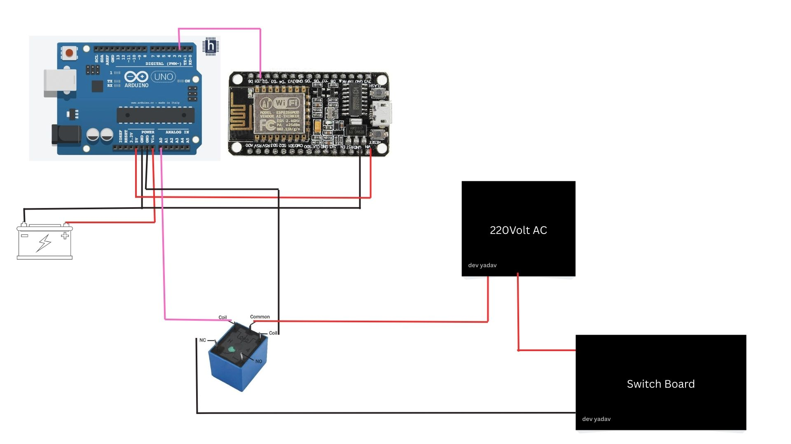

# Mobile-controlled-switch-
This switch board can controlled by your mobile phone from any point in the world.

PURPOSE TO BUILD THIS PROJECT :
- I am pursuing electronics and communication engineering degree from Govt. engineering college(Rajkot,Gujrat) that belongs from Gujrat technological university and I have made this project to Control actuators from online IOT apps, so if you want to learn how to Control actuators from Online IOT apps then this project will very helpful for learners.

UNIQUENESS OF THIS PROJECT :
- On the entire internet i have searched "How to use raw relay for smaller currents?" but there is 0.0001% of containt is available and that is not suffieciant to understand the core relay mechanism so from this project you can get that core knowledge about Raw relay.

- 

  BASIC DESCRIPTION OF THIS PROJECT :
- In this project i have used a ESP8266 to control the Switch by IOT apps because it have inbuild WiFi and to control the relay by giving 5volt(ON)/0volt(OFF) i have used arduino uno board's analog pin

  LIST OF COMPONENTS WHICH IS USED :
- Microcontroller: Arduino Uno  
- Wireless Module: ESP8266 (NodeMCU)      
- Raw relay
- Jumper wires
- Switch board
- power supply for Arduino uno

  ISSUES DURING THIS PROJECT :
- (1)i have faced a major issues during this project is to control raw relay with any transistors , diodes and ext. componenets because there is not more info. about "How to use raw relay?".
  SOLUTION OF ISSUES :
- (1) firstly i have understand the core mechanism of raw real and then i get an idea to control the relay from arduino's analog pin.

  HOW TO USE THIS PROJECT INDIVIDUALLY OR HOW TO USE COMPONENTS INDIVIDUALLY:
  (1)  you can use "espcode" to transfer and recive data from Blynk IoT app/cloud apps.
  (2) you can use "unocode" to control raw relay from arduino uno without any realt module or any transisitors and diodes.
  HOW TO BUILD THIS SAME PROJECT :
- (1) Upload the "unocode" code in arduino uno.
- (2) Install "Blynk IoT" from google playstore on your mobile phone.      
- (3) complete the registration process and make a template name SWITCH and add an ON/OFF button on template.
- (4) repalce this details in code by your details and paste it in "espcode"
- [#define BLYNK_TEMPLATE_NAME "Bulb"
  #define BLYNK_TEMPLATE_ID "TMPL3KaCCAjtJ"
  #define BLYNK_AUTH_TOKEN "iuqIsQpA-ZCWGfVYqfK6lLHyIt0B5cjz"
  #define wifissid "Dev"
  #define wifipass "00000000"]     
- (5) Upload the "espcode" code in ESP8266.       
- (6) connect the jumper wires/circuit connections according to given diagram image.
  

  HOW TO USE ESP8266 CODE TO COMMUNICATE BETWEEN MOBILE AND ESP82666:
- when signal comes from IoT app esp will send a HIGH signal to arduino and when arduino read the HIGH/LOW accordingly it will on/off the relay.    
      
       
